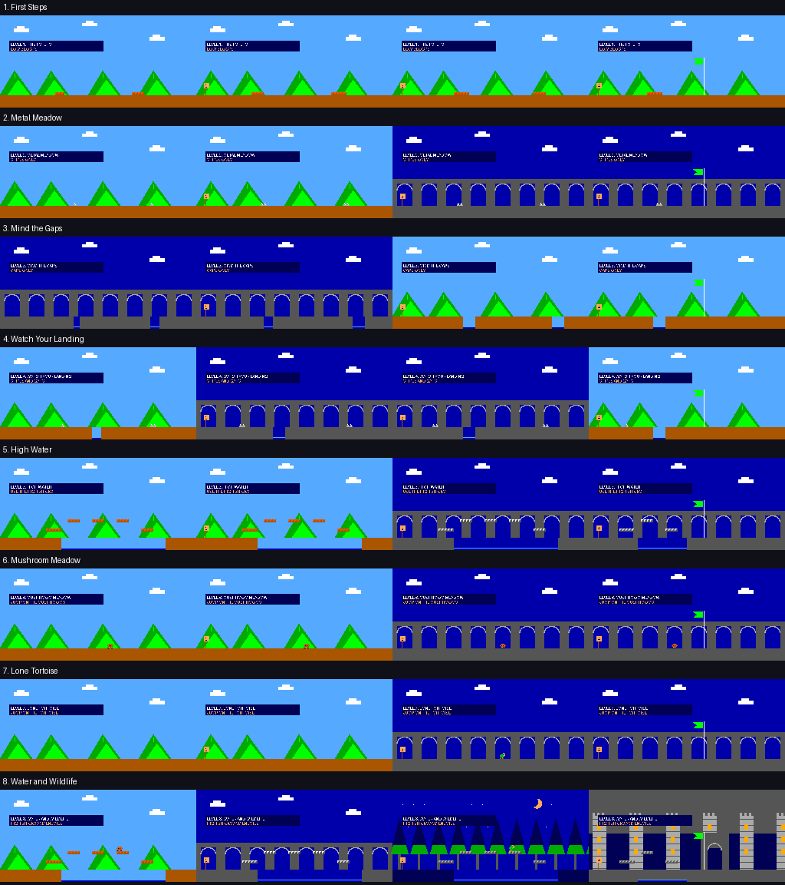

# Mario goes ASIC

An eight-level scrolling VGA platformer for one Tiny Tapeout tile, backed by a
16 MiB QSPI flash PMOD. Each world is 2,048 × 240 logical pixels (6.4 screen widths).
The ASIC streams VGA and reads precomputed gameplay transitions; it has no CPU
or framebuffer. Mario and camera movement interpolate at 60 Hz, with gameplay
and enemy animation at 15 Hz. PSRAM is unused.



See [the datasheet](docs/info.md) for wiring, controls, level selection and operation,
and [flash preparation](docs/flash.md) for the required external memory contents.

## Build and test

Use Python 3.11+, GNU Make and Icarus Verilog with `vvp` on PATH:

```sh
python3 -m venv .venv
. .venv/bin/activate
pip install -r test/requirements.txt
make check flash-image smoke
```

`make check` builds assets, validates the gameplay tables, simulates a complete
campaign over QSPI, checks controllers/DIP selection and maintenance operation,
and compares base, interpolated and enemy VGA frames pixel by pixel.
`make smoke` runs the public-pin Cocotb test also used by gate-level CI.
`make flash-image` exports a physical flash image with address relocation applied.
Generated outputs go in ignored `build/`; they do not belong in synthesis inputs.

Edit `assets/levels.json` for geometry and enemies, `assets/sprites.json` and
`assets/enemies.json` for artwork, and `scripts/world.py` for gameplay rules.
`make assets` regenerates the flash content; `make images` exports PNGs into
ignored `images/`. Changing rules or geometry may exceed the allocated state
banks; the compiler checks this. The flash data format must match this RTL.

## ASIC submission

Only `src/tt_um_mario_levels.v` and `src/controls.v` are synthesis sources.
`info.yaml` requests `1x1`, at 25.2 MHz; the template clock constraint is 39.68 ns.
The cloned SKY130 shuttle's GDS, precheck, gate-level and documentation workflows
are retained. Push the prepared repository to run those workflows.

The source design measured **9,634.24 µm² of mapped SKY130 cells**, with 208
flip-flops. This is not a placed-and-routed result: one-tile fit, ASIC timing and
precheck remain to be confirmed by the GDS workflow. Local RTL simulation and
FPGA operation do not replace those checks.

## Optional FPGA build

`make fpga` uses Yosys, nextpnr-ice40 and IceStorm with the FabricFox wrapper and
pin constraints in `fpga/`. This wrapper is not an ASIC source. The source design
used 640/5,280 FPGA logic cells and no block RAM, DSP or PLL; these are previously
measured FPGA results, not ASIC resource counts.

For a local mapped-area estimate, run `make area LIBERTY=/path/to/sky130.lib`.
No workstation-specific paths or tools are included.

## Repository contents and limitations

The flash assets occupy 12,845,312 bytes; the dedicated-chip image is 16 MiB
including erased space. Keep binaries, manifests/checksums and any bitstreams as
release artifacts rather than committing the generated `build/` directory.

`scripts/levels_flash.py`, `flash_progress.py`, `levels_board.py` and
`flash_pmod.py` are FabricFox MicroPython reference helpers, included with their
host-side tests. They are not a generic ASIC-board uploader. The previous
workstation-specific migration uploader and its backups are intentionally omitted.

Enemies can be stomped; tortoises have no shell mechanic. Enemy state is retained
only within the current checkpoint section. One-hit shields are not implemented.
The repository retains the template Apache-2.0 license. Mario and related names
and characters belong to their respective owners; this is an independent project.
